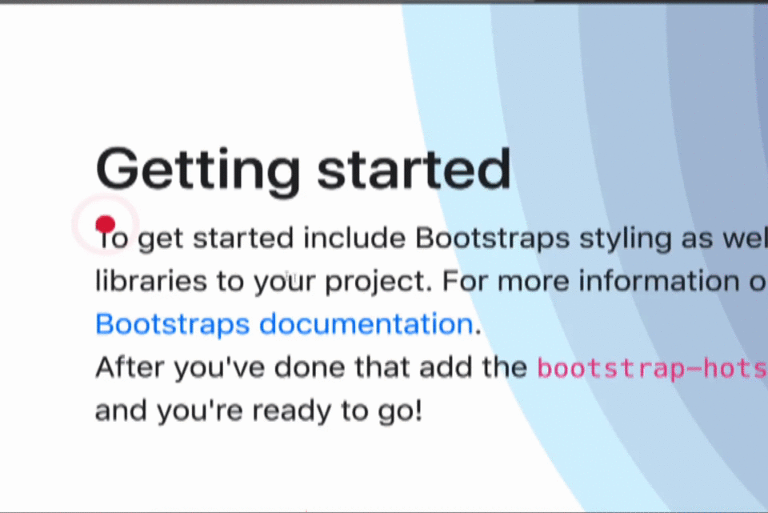

# Bootstrap Hotspots
Simple hotspots for Bootstrap

## Getting started
To get started simply add Bootstrap 4 to your project and add the css or minified css file to your project.
Or simple copy the css code and add it to your css.

This does require Bootstraps popovers so make sure to add Bootstraps javascript as well.

## Adding a hotspot
To add a hotspot simple add the following code as a child of the element you want the hotspot to be on:
``

As you can see this uses Bootstraps normal popovers so you can just use the `data-title` and `data-content` attributes like normal.
You can also use the `data-placement` attribute to define where the content should be shown.
For more info visit [Bootstraps docs](https://getbootstrap.com/docs/4.3/components/popovers/).

Hotspots are positioned absolutely, this means the parent element should be positioned relatively by adding either the class `.position-relative` or by adding `position:absolute` in css to the parent element.

### Positioning the hotspot!
As mentioned before the hotspots are positioned absolute. There are six classes included in the styling to position the element.
The default positioning classes are: `.top`, `.bottom`, `.left` and `.right`. This will position the element at the top or bottom and left or right.
You should add either top or bottom as well as either left or right.
You can center the hotspot vertically by using the `.center-y` class, or horizontally by using the `.center-x` class.
If you don't add classes the hotspot will default be at the top left of the element.

### Adding hotspots to elements without children!
Certain HTML-elements do no allow you to add a child element to them. This means you can't add the hotspot element to elements like inputs and images.
But you can still add a hotspot to those elements by adding a parent wrapper element. For example add a div with class `.position-relative` and then add the element and the hotspot as separate children.

### Adding hotspots to buttons or links!
Watch out. While buttons and links allow for children there is an issue.
If you add the hotspot to a button or link, clicking it will cause the button or link to get clicked. For these situations you should also use a parent wrapper and add the highlight and the button or link as separate children.
